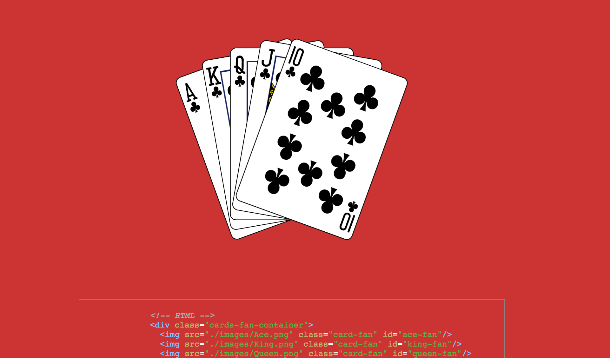

[live][casino]
[casino]: https://gpatuwo.github.io/css-casino/

##### CSS Casino demos animations using purely HTML and CSS.

# Instructions
Hover over each graphic to activate the animation. For the roulette wheel, try to catch the card by holding down a click!

# Features & Implementation

## Card Flips
This section reveals a royal flush upon hover:

To animate the flipping of the cards, I created two divs: one for the front card (the face card) and one for the back. These two cards were then positioned absolutely on top of each other. A background image was set for each side, to be revealed through a CSS transition transformation effect :
``` css
.cards:hover .card {
  transform: rotateY(180deg);
}

.card {
  position: relative;
  transition: 0.5s;
  transform-style: preserve-3d;
}

.front-card, .back-card {
  position: absolute;
}

.back-card {
  background-image: url('../images/playing-card-back.png');
  background-size: 100% 100%;
  transform: rotateY(0deg);
}

.front-card {
  transform: rotateY(180deg);
  background-size: 100% 100%;
}

#ace {
  background-image: url('../images/Ace.png');
}
#king{
  background-image: url('../images/King.png');
}
#queen {
  background-image: url('../images/Queen.png');
}
#jack {
  background-image: url('../images/Jack.png');
}
#ten {
  background-image: url('../images/Ten.png');
}
```
## Card Fan
This section reveals a royal flush upon hover:


The code for animating this action:
``` css
.card-fan {
  position: absolute;
  width: 200px;
  transform-origin: bottom;
  transition: all .3s linear;
}

.cards-fan-container:hover #ten-fan{
  transform: rotate(20deg)
}
.cards-fan-container:hover #ace-fan{
  transform: rotate(-20deg)
}
.cards-fan-container:hover #jack-fan{
  transform: rotate(10deg)
}
.cards-fan-container:hover #king-fan{
  transform: rotate(-10deg)
}
```

## Roulette Wheel
The roulette wheel starts rotating when you hover over the image.


The code for making this happen:
``` css
.window {
  display: block;
  width: 1000px;
  height: 450px;
  overflow: hidden;
}

#wheel {
  width: 100%;
  cursor: pointer;
}
#wheel:hover {
  animation: wheel 1s linear 0s infinite;
}

#wheel:active {
  animation-play-state: paused;
}

@keyframes wheel {
  100% {
    transform: rotateZ(360deg);
  }
}
```
# Future Features
- [ ] Dice shake, roll + drop
- [ ] Animated logo that flashes the lights on and off
